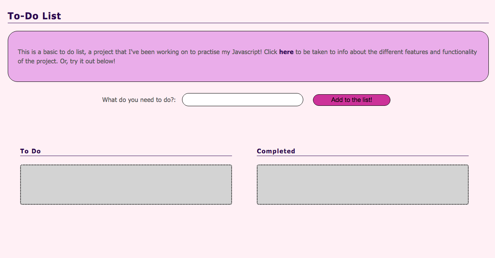

# To-do-list

This is basic "to do list"!

View the project here:

[https://bnewing.github.io/to-do-list-v2](https://bnewing.github.io/to-do-list-v2)

## What the Project Does

- You can only add in 10 list items - intentional cap so your list doesn't get too long!
- You can drag and drop list items into the two different lists
- Fully functional on touch devices
- The design is mobile responsive
- Clicking on status label changes which list the item is in
- Empty list items can't be created
- List items are stored within the browser (lost after tab is closed)

View the project here:

[https://bnewing.github.io/to-do-list-v2](https://bnewing.github.io/to-do-list-v2)

## Technologies Used

- HTML
- Stylus
- JavaScript
- Interact.js
- Webpack

## How to Set Up the Dev Environment

After cloning this, you'll need to run:

`npm install`

This will install all of the dependencies that you need.

## How to Suggest a Change

You can either raise an issue in the tab, or create a pull request to address the issue!

To do the latter, firstly, fork the branch, and then clone this into your GitHub folder (or wherever else you store your GitHub projects).

After you've created any changes, to compile it, you'll need to run:

`npm run webpack`

To run the local dev server to see changes you've made, you'll need run:

`npm start`

The local host will be at localhost:8080. Then, follow the steps listed here:

[https://help.github.com/articles/creating-a-pull-request-from-a-fork/](https://help.github.com/articles/creating-a-pull-request-from-a-fork/) to create the pull request.

## Change Log

This repo is version two. Version two has an improved organisation structure and also has touch screen functionality.

Version one can be found here:

[https://github.com/BNewing/to-do-list](https://github.com/BNewing/to-do-list)
